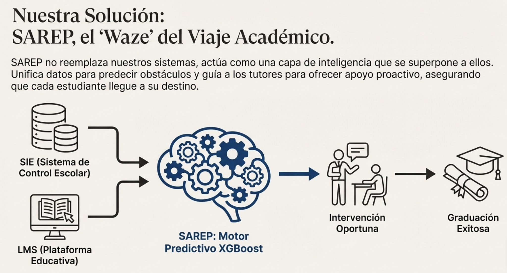
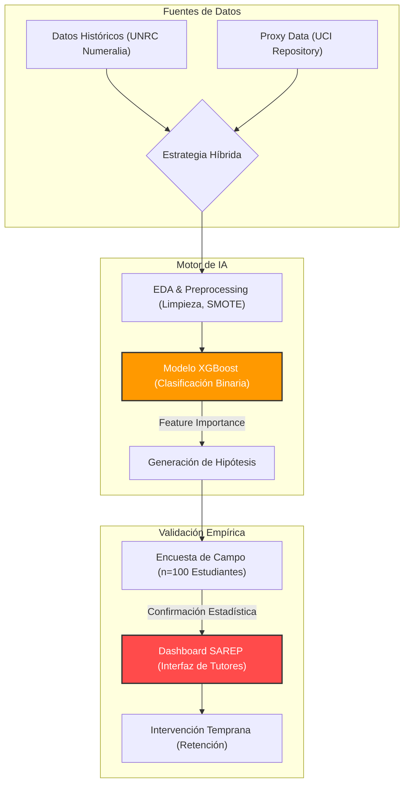

# SAREP: Sistema de Acompañamiento y Retención Estudiantil Proactivo (UNRC)



  

## Resumen Ejecutivo

Este repositorio contiene la evidencia metodológica, el código fuente y los resultados del estudio **"De la Puerta Giratoria a la Vía de Graduación"**. El proyecto implementa un sistema predictivo y de intervención temprana para reducir la deserción estudiantil en la Universidad Nacional Rosario Castellanos (UNRC), utilizando técnicas de Machine Learning (XGBoost) y análisis estadístico riguroso.

### 📄 Documentación Oficial

Acceso directo a los entregables clave del proyecto:

- **📕 Reporte Técnico Final:** [SAREP_Final_Report.pdf](references/SAREP_Final_Report.pdf)
- **📊 Presentación Ejecutiva:** [Exposicion_Final.pdf](references/Exposicion_Final.pdf)

### Arquitectura del Proyecto



## Mapa del Repositorio

Este compendio digital está estructurado para facilitar la auditoría de los resultados presentados en el informe técnico:

| Directorio | Descripción |
| :--- | :--- |
| **`📂 notebooks/`** | **Narrativa secuencial del descubrimiento.** Contiene los notebooks desde la limpieza de datos hasta el modelado. <br> • **`04_Modelo_Binario_Final.ipynb`**: **Notebook principal** con el entrenamiento del modelo final y evaluación de métricas. <br> • `anexos_conceptuales/`: Explicaciones detalladas de métricas (F1-Score, AUC-ROC) y validaciones. |
| **`📂 src/analysis/`** | **Scripts de validación estadística.** Código fuente para las pruebas de hipótesis citadas en el Anexo (Chi-Cuadrado, Kruskal-Wallis). |
| **`📂 app/`** | **Prototipo funcional del Dashboard.** Código de la aplicación Streamlit diseñada para que los tutores visualicen el riesgo de deserción y gestionen intervenciones. |
| **`📂 reports/`** | **Evidencia y Resultados.** <br> • `figures/`: Gráficos generados (distribuciones, importancia de características, matrices de confusión). <br> • `metrics/`: Archivos JSON con las métricas de desempeño de los modelos. <br> • `annex.md`: Anexo técnico detallado. |
| **`📂 docs/`** | **Documentación Técnica.** Detalles sobre la arquitectura del sistema e interpretabilidad de características. |

## Guía de Reproducibilidad

Para replicar el entorno de análisis y ejecutar el dashboard:

1. **Instalar dependencias:**

    ```bash
    pip install -r requirements.txt
    ```

2. **Ejecutar el Dashboard (Prototipo):**

    ```bash
    streamlit run app/dashboard_unrc.py
    ```

    *(Nota: Asegúrate de estar en el directorio raíz del proyecto)*

---
*Proyecto desarrollado para la Universidad Nacional de Rosario Castellanos (UNRC).*
