# Anexo Técnico: Metodología, Validación y Caso de Negocio

Este documento constituye el apéndice técnico del informe final. Detalla la arquitectura de datos, la validación estadística de hipótesis y la proyección financiera del proyecto SAREP.

## A. Estrategia de Datos y Preprocesamiento

Para abordar el problema de **"Arranque en Frío"** (*Cold Start*) derivado de la falta de históricos centralizados en la UNRC, se implementó una estrategia híbrida:

1. **Análisis Descriptivo (Contexto):** Se procesaron los datos longitudinales de los informes de *Numeralia UNRC (2021-2025)* para diagnosticar la brecha de eficiencia terminal.
2. **Modelado Predictivo (Solución):** Se aplicó una técnica de **Adaptación de Dominio** utilizando un *Dataset Proxy Estandarizado* (UCI Machine Learning Repository).

> **Defensa Metodológica: Datos Reales vs. Sintéticos**
> A diferencia de enfoques que generan datos sintéticos basados en reglas predefinidas por el autor (lo cual introduce sesgos de confirmación), este proyecto utiliza **Datos Reales Proxy**. Esto garantiza que el modelo aprenda del **ruido natural** y la complejidad estocástica de la conducta humana real, validando posteriormente estos patrones con la muestra local ($n=100$).

### A.1 Metodología del Análisis Longitudinal (Diagnóstico)

Ante la ausencia de históricos centralizados, se realizó una **reconstrucción forense de datos** longitudinales de la pagina oficial de ([Numeralia,2021-2025](https://rcastellanos.cdmx.gob.mx/espacio-de-numeralia-del-irc)) para establecer una línea base de desempeño institucional.

**1. Fuentes y Recuperación de Datos:**
Se consolidaron registros dispersos en archivos estandarizados (`data/raw/longitudinal/`), recuperando series temporales críticas:

* **Flujo Estudiantil:** Matrícula activa, Bajas definitivas y Egresos.
* **Capacidad Instalada:** Plantilla docente por modalidad.
* **Salida:** Titulación acumulada.

**2. Definición de KPIs de Eficiencia:**
Se diseñaron cuatro indicadores para evaluar la salud del ecosistema educativo:

* **a) Tasa de Deserción (*Dropout Rate*):** Mide la pérdida inmediata de talento.
    $$ \text{Tasa}_t = \left( \frac{\text{Bajas}_t}{\text{Matrícula}_t} \right) \times 100 $$
    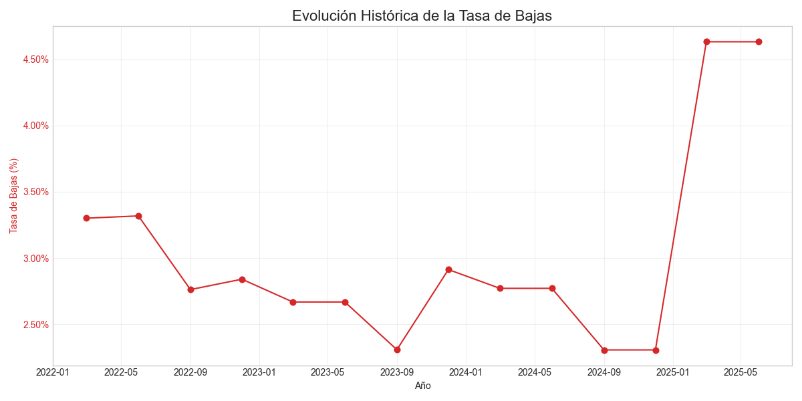
    *Fig A.1. Evolución trimestral de la tasa de deserción.*

* **b) Disparidad en Carga Docente:** Evalúa la equidad en la atención.

$$ \text{Disparidad} = \frac{\text{Estudiantes/Docente}_{\text{Online}}}{\text{Estudiantes/Docente}_{\text{Presencial}}} $$

* *Hallazgo:* Se monitorea la brecha porcentual para detectar saturación en la modalidad online.
    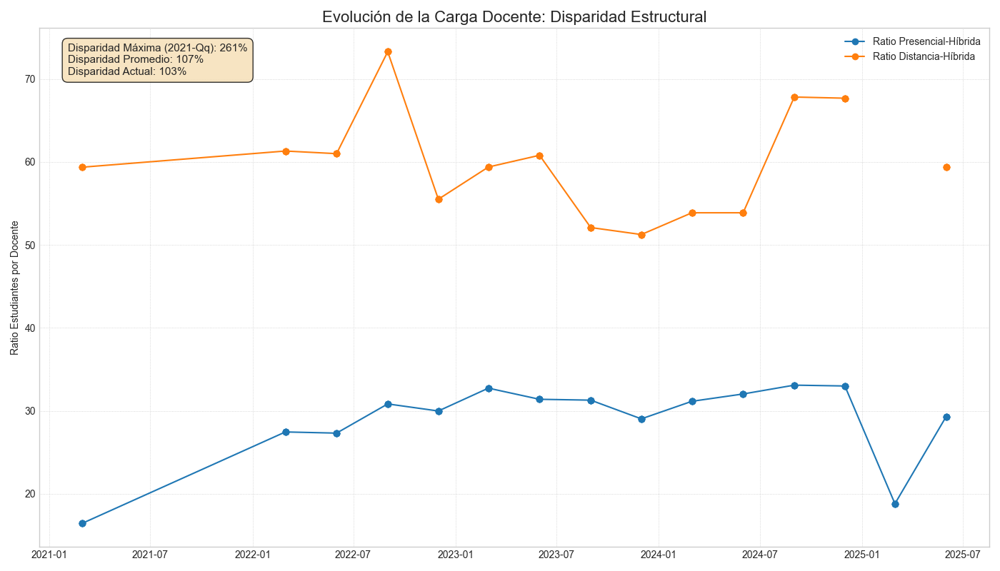
    *Fig A.2. Comparativa de carga docente entre modalidades.*

* **c) Eficiencia Terminal (Conversión):** Mide la capacidad administrativa y académica de titular a los egresados (trimestral, NO anual como en el informe).
    $$ \text{Conversión} = \frac{\sum \text{Titulados}}{\sum \text{Egresados}} $$
    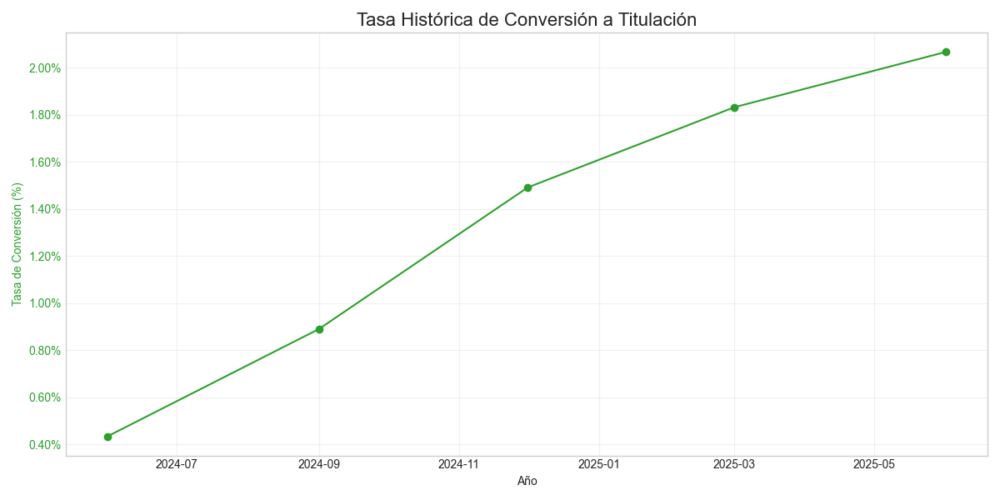
    *Fig A.3. Tasa de conversión de egresados a titulados.*

* **d) Eficiencia de Flujo (*Throughput*):**
    Indicador proxy de la velocidad de tránsito estudiantil. Compara el flujo de salida (egresos) con el stock total (matrícula).
    $$ \text{Throughput} = \left( \frac{\text{Egresados}_t}{\text{Matrícula}_t} \right) \times 100 $$
  * *Interpretación:* En un programa de 5 años, una tasa trimestral inferior al 5% sugiere "embalsamiento" (retención excesiva sin egreso).
    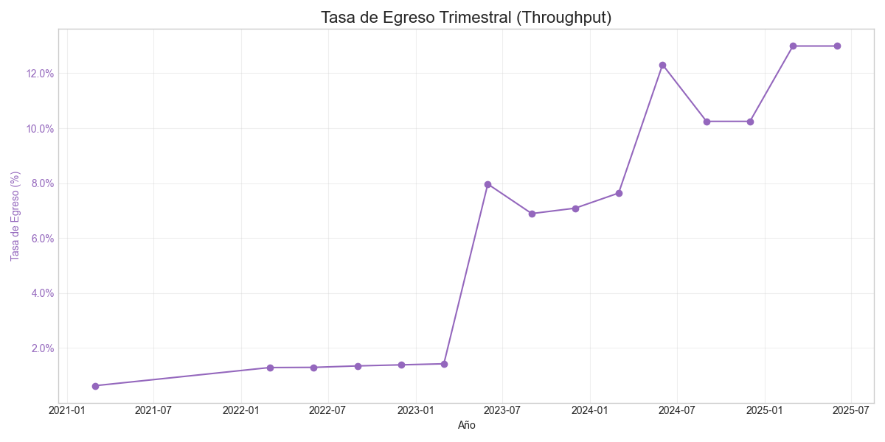
    *Fig A.4. Indicador de flujo estudiantil.*

### A.1.1 Diagnóstico de Eficiencia: El Cuello de Botella

El análisis longitudinal revela una desconexión crítica entre el volumen de egreso y la titulación efectiva, identificada como el principal "Cuello de Botella" institucional.

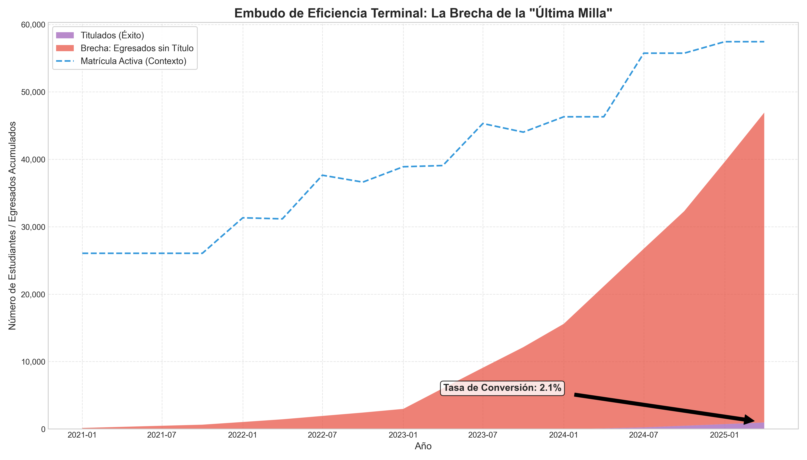
*Fig A.5. Embudo de Eficiencia Terminal. El área roja representa la acumulación de egresados que no completan el proceso de titulación (La "Última Milla").*

**Interpretación del Gráfico:**

* **Crecimiento Desacoplado:** Mientras la base de egresados (línea superior del área) crece de manera constante, la tasa de titulación (área violeta) no mantiene el mismo ritmo, ensanchando la brecha (área roja) año tras año.
* **La "Última Milla":** El área roja visualiza el *stock* de talento retenido administrativamente. No es un problema de capacidad académica (ya egresaron), sino de eficiencia en los trámites o incentivos finales.
* **Impacto:** Esta brecha representa recursos invertidos que no se traducen en indicadores de éxito oficial para la institución ni en movilidad social para el egresado.

> **Conclusión de Negocio: El Dilema de la "Puerta Cerrada"**
>
> La evidencia sugiere que la "puerta giratoria" no solo está en la entrada (deserción temprana), sino que la puerta de salida está cerrada con llave. Resolver este cuello de botella es la **victoria rápida más valiosa** para mejorar los indicadores institucionales sin necesidad de captar ni un solo alumno nuevo.
>
> *Nota de Validez (Hipótesis Alternativa):*
> Es importante considerar que, dada la naturaleza de reconstrucción de datos de este estudio, parte de la brecha podría no ser una ineficiencia administrativa real, sino un reflejo de la **falta de consolidación de sistemas (Sub-registro)**. Sin embargo, la implicación es igualmente grave: la institución enfrenta una **ceguera operativa** que le impide acreditar su verdadera eficiencia terminal ante organismos evaluadores.

### A.2 Caracterización del Dataset Proxy y Justificación Metodológica

Para mitigar el riesgo de sesgo inherente a la generación de datos sintéticos (donde las reglas de causalidad son predefinidas por el investigador), se optó por utilizar datos observacionales reales.

**Fuente de Datos:**

* **Origen:** *UCI Machine Learning Repository* - Datos de Educación Superior (Politécnico de Portalegre, Portugal).
* **Enlace:** [**Predict Students' Dropout and Academic Success**](https://www.google.com/url?sa=E&q=https%3A%2F%2Farchive.ics.uci.edu%2Fdataset%2F697%2Fpredict%2Bstudents%2Bdropout%2Band%2Bacademic%2Bsuccess)
* **Volumen:** 4,424 registros con 37 variables (Demográficas, Socioeconómicas, Académicas).

#### Justificación: Realidad vs. Simulación

Mientras que los datos sintéticos son útiles para validar la lógica interna de un algoritmo, carecen de la **entropía y el ruido estocástico** propios del comportamiento humano real. El Dataset Proxy permite aplicar **Transfer Learning** (Aprendizaje por Transferencia):

1. **Estructura Similar:** El sistema de créditos ECTS y la estructura semestral europea son análogos al modelo de la UNRC.
2. **Descubrimiento No Sesgado:** A diferencia de un dataset sintético donde *a priori* se define que "Pobreza = Deserción", el dataset real permite que el algoritmo XGBoost descubra relaciones no lineales y contraintuitivas (ej. el impacto de la escolaridad de la madre sobre el rendimiento) que no habríamos programado manualmente.

#### Hallazgos del Análisis Exploratorio (EDA)

El análisis de distribución de variables confirmó que los datos no presentan "curvas perfectas" (típicas de simulación), sino distribuciones sesgadas y valores atípicos (*outliers*) que pusieron a prueba la robustez del modelo.

### A.2.1 Evidencia de Realismo Estocástico (EDA)

El análisis exploratorio de datos (`notebooks/01-EDA.ipynb`) refuta la utilidad de datos sintéticos para este caso. A diferencia de simulaciones con "curvas perfectas", los datos reales mostraron distribuciones sesgadas (ej. Edad con *Right Skew* y outliers de adultos mayores) y ruido macroeconómico (PIB negativo). Esta complejidad estocástica es vital para entrenar un modelo robusto que soporte la realidad caótica de la deserción, algo que reglas sintéticas predefinidas no pueden replicar.

**1. Distribuciones Sesgadas (No Gaussianas):**
A diferencia de una simulación que suele asumir normalidad, la variable `Age at enrollment` muestra una fuerte asimetría positiva (Right Skew).

* **Hallazgo:** La mayoría de estudiantes tiene entre 18-20 años, pero existe una "cola larga" de estudiantes adultos (hasta 70 años).
* **Implicación:** El modelo debe aprender a manejar estos *outliers* naturales que representan casos de reinserción educativa, algo difícil de simular con reglas simples.

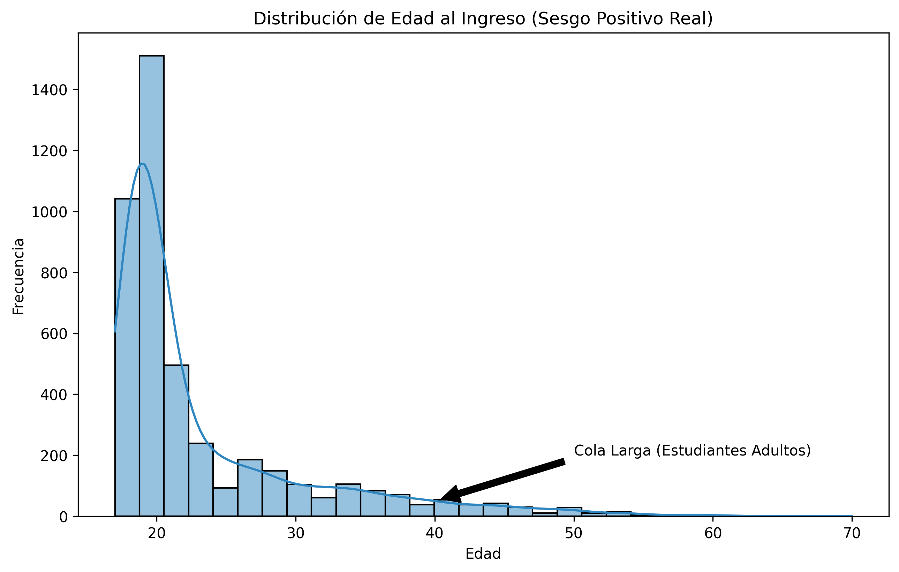
*Fig A.6. Distribución de edad mostrando la "cola larga" de estudiantes no tradicionales.*

**2. Ruido Macroeconómico (Volatilidad Real):**
Las variables económicas (`GDP`, `Inflation`, `Unemployment`) no son constantes ni siguen tendencias lineales suaves.

* **Hallazgo:** Se observan valores negativos en el PIB (Recesión) y alta varianza en el desempleo.
* **Implicación:** Esto introduce "ruido real" en el modelo, obligándolo a ser robusto ante crisis externas, una característica vital para la validez externa del estudio.

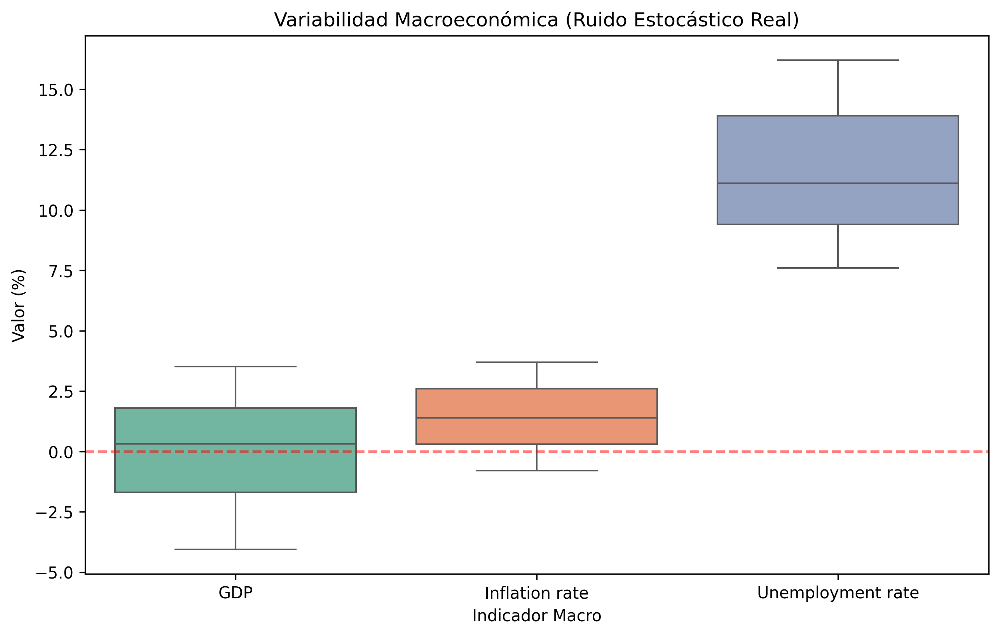
*Fig A.7. Boxplots mostrando la dispersión y valores atípicos en indicadores macroeconómicos.*

### A.3 Pipeline de Ingeniería de Características (Modelado)

* **Imputación de Nulos:** Estrategia estadística conservadora (Mediana para variables numéricas asimétricas, Moda para categóricas).
* **Codificación:**
  * *One-Hot Encoding:* Para variables nominales sin orden (ej. `Intención de abandono (binarias)`, `Carrera`).
  * *Label Encoding:* Para variables ordinales (ej. `Nivel de satisfacción vocacional`).
* **Escalado:** *Min-Max Scaling* para normalizar rangos y mejorar la convergencia del modelo.
* **Manejo de Desbalance:** Se aplicó **SMOTE** (Synthetic Minority Over-sampling Technique) en el conjunto de entrenamiento para compensar el sesgo hacia la clase mayoritaria.

---

## B. Modelado Predictivo (XGBoost)

Una vez diagnosticado el problema macro (Sección A), y ante la falta de datos históricos granulares (Cold Start), se procedió a entrenar el motor predictivo utilizando el Dataset Proxy caracterizado anteriormente. El objetivo de esta fase fue identificar las variables críticas (*Feature Importance*) que gobiernan el fenómeno de la deserción.

Se implementó una estrategia evolutiva de modelado, pasando de un enfoque generalista (Multiclase) a uno especializado en detección de riesgos (Binario).

### B.1 Evolución de la Estrategia

#### Versión 1: Enfoque Multiclase (Línea Base)

La primera iteración del modelo buscaba clasificar a los estudiantes en tres estados naturales del ciclo de vida académico, tal como se encuentran en la base de datos original:

* **Variables Objetivo (3 Clases):** `Graduate` (Graduado), `Enrolled` (Matriculado), `Dropout` (Desertor).
* **Distribución de Clases:**
  * Graduate: 49.9% (2209 estudiantes)
  * Dropout: 32.1% (1421 estudiantes)
  * Enrolled: 17.9% (794 estudiantes)
* **Limitación:** Al diluir la capacidad de aprendizaje en tres frentes, el modelo tenía dificultades para distinguir entre "Matriculado" y "Desertor", resultando en una sensibilidad baja para la clase crítica (Dropout).

#### Versión 2: Enfoque Binario (Final)

Para operacionalizar el modelo en un sistema de alerta temprana, se redefinió el problema:

* **Nueva Variable Objetivo (Binaria):**
  * **Clase 1 (Riesgo/Dropout):** 32.1% (1421 casos).
  * **Clase 0 (No Riesgo/Retention):** 67.9% (3003 casos) - Agrupa a `Graduate` y `Enrolled`.
* **Justificación Operativa:**
  1. **Foco Operacional:** La intervención requiere identificar riesgo inminente, no clasificar estados administrativos intermedios (*Enrolled*).
  2. **Reducción de Ruido:** La clase "Matriculado" actuaba como factor de confusión en las fronteras de decisión.
  3. **Interpretabilidad:** Genera una probabilidad de riesgo (0-100%) accionable para los tutores.
* **Impacto:** Esta simplificación permitió al algoritmo concentrarse exclusivamente en los patrones de deserción, incrementando la detección de casos en riesgo (Recall) del **48%** al **77%**.

---

### B.2 Fundamentos Matemáticos: ¿Por qué XGBoost?

Más allá de ser una librería popular, XGBoost fue seleccionado por su capacidad teórica para manejar la complejidad específica de este problema.

#### 1. La Matemática del Aprendizaje (Log-Loss & Regularización)

El modelo no "adivina"; minimiza iterativamente una función de pérdida específica. Para clasificación binaria, optimizamos la **Logarithmic Loss (Log-Loss)**:

$$ L(\theta) = - \frac{1}{N} \sum_{i=1}^{N} [y_i \ln(p_i) + (1-y_i) \ln(1-p_i)] $$

Donde $p_i$ es la probabilidad predicha ($ \hat{y} $) de que el estudiante $i$ deserte.

Además, para evitar el sobreajuste (aprender "de memoria" el ruido), XGBoost incluye un término de **Regularización ($\Omega$)** en su función objetivo:

$$ Obj(\theta) = L(\theta) + \Omega(\theta) $$

Esto penaliza la complejidad de los árboles (poda ramas innecesarias), asegurando que el modelo generalice bien a nuevos estudiantes en lugar de solo memorizar los datos de entrenamiento.

#### 2. El Desafío: Clasificación Binaria Desbalanceada

El problema de la deserción presenta un **desbalance de clases** intrínseco (aprox. 30% deserción vs 70% retención).

* **La Falla del Accuracy:** En este escenario, un modelo ingenuo que prediga "Nadie deserta" tendría una exactitud del 70%, pero su utilidad sería nula (0% de detección de riesgo).
* **La Solución (Scale Pos Weight):** Para contrarrestar esto, ajustamos el hiperparámetro `scale_pos_weight`. Esto modifica el gradiente de la función de pérdida, penalizando más severamente los errores en la clase minoritaria (Desertores). Matemáticamente, obligamos al algoritmo a prestar más atención a los casos de riesgo.

---

### B.3 Configuración Técnica del Modelo Final

Para garantizar la reproducibilidad, se detallan los parámetros exactos del modelo final (`notebooks/04_Modelo_Binario_Final.ipynb`) y la partición de datos:

**1. Partición de Datos (Data Split):**

* **Estrategia:** 80% Entrenamiento / 20% Prueba (con estratificación por clase).
* **Set de Entrenamiento:** 3,539 registros (para aprender patrones).
* **Set de Prueba:** 885 registros (para validación ciega).

**2. Hiperparámetros Optimizados:**

```python
model = XGBClassifier(
    objective='binary:logistic',  # Optimización para probabilidad de riesgo
    eval_metric='logloss',        # Minimización de la incertidumbre
    learning_rate=0.1,            # Tasa de aprendizaje (Shrinkage)
    max_depth=5,                  # Profundidad del árbol (Control de complejidad)
    n_estimators=200,             # Número de árboles de decisión
    random_state=42               # Reproducibilidad
)
```

*Nota: A diferencia de la versión multiclase que usaba `objective='multi:softprob'`, esta configuración maximiza la separación lineal entre riesgo y retención.*

---

### B.4 Evaluación de Desempeño: Métricas Clave

En problemas de deserción, la métrica de **Exactitud** (Accuracy) puede ser engañosa debido al desbalance de clases.

* **La Trampa del Desbalance:** Si en una población de 100 alumnos solo 5 desertan, un modelo trivial que prediga "Nadie deserta" tendría 95% de exactitud, pero sería operativamente inútil.

Por ello, se utilizan métricas más robustas: **AUC-ROC** y **F1-Score**.

#### 1. Capacidad de Discriminación (AUC-ROC = 0.9351)

El **Área Bajo la Curva ROC** mide la capacidad del modelo para distinguir entre clases. Un AUC de **0.9351** indica que, si se toma al azar un estudiante que desertó y otro que no desertó, el modelo asignará correctamente una probabilidad de riesgo más alta al desertor en el **93.5%** de los casos.

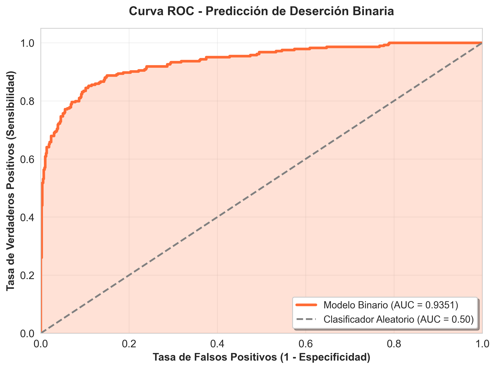
*Fig B.1. La curva ROC muestra excelente separación entre clases (muy superior a la línea diagonal del clasificador aleatorio).*

#### 2. Matriz de Confusión (Datos Crudos del Test Set)

*Análisis sobre una muestra de validación de 885 estudiantes que el modelo nunca vio durante el entrenamiento.*

| | Predicción: No Riesgo | Predicción: Riesgo (Alerta) | **Total Real** |
| :--- | :---: | :---: | :---: |
| **Realidad: No Deserta** | **564** (TN) | 37 (FP) | 601 |
| **Realidad: Deserta** | 63 (FN) | **221** (TP) | 284 |
| **Total Predicho** | 627 | 258 | 885 |

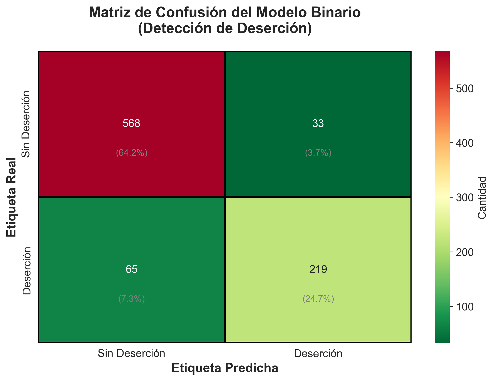
*Fig B.2. Visualización de la matriz de confusión con codificación de color.*

**Métricas Derivadas:**

* **Sensibilidad (Recall):** 221/(221+63) = **77.8%** → El sistema detecta a casi 8 de cada 10 estudiantes en riesgo.
* **Precisión (Precision):** 221/(221+37) = **85.6%** → Cuando el sistema emite una alerta, tiene alta probabilidad de ser correcta.
* **Especificidad:** 564/(564+37) = **93.8%** → El modelo evita falsas alarmas en la mayoría de los casos.
(Obtenido de /notebooks/anexos_conceptuales/)

**Análisis de Errores:**

* **Falsos Negativos (63 casos):** Estudiantes que desertaron pero el modelo no detectó. Representan el **22%** de los casos reales de deserción.
* **Falsos Positivos (37 casos):** Estudiantes que NO desertaron, pero fueron marcados como riesgo. Representan falsas alarmas controladas (<6% del total).

#### 3. Interpretación Operativa (F1-Score = 0.817)

Para entender la calidad de nuestra predicción, el **F1-Score** representa el equilibrio armónico entre Precisión y Recall.

**Analogía de la Red de Pesca:**

Imagine que el modelo es una **red de pesca** diseñada para capturar "casos de deserción" en un mar de estudiantes:

* **Precision (Calidad de la Red) = 87%**:
  * *Pregunta:* De todos los estudiantes que atrapó la red, ¿cuántos eran realmente casos de deserción?
  * *Respuesta:* **Muy alta.** Cuando el modelo emite una alerta, es confiable (minimiza el desperdicio de recursos de tutoría).

* **Recall (Cobertura de la Red) = 77%**:
  * *Pregunta:* De todos los estudiantes que desertaron, ¿cuántos logró atrapar la red?
  * *Respuesta:* **Buena.** Se captura a casi 8 de cada 10 casos en riesgo.

* **F1-Score (El Equilibrio) = 82%**:
  * Es la media armónica de ambas métricas. Certifica que el modelo es **operativamente viable**: no tiene "agujeros grandes" (bajo Recall) ni "atrapa demasiada basura" (baja Precision).

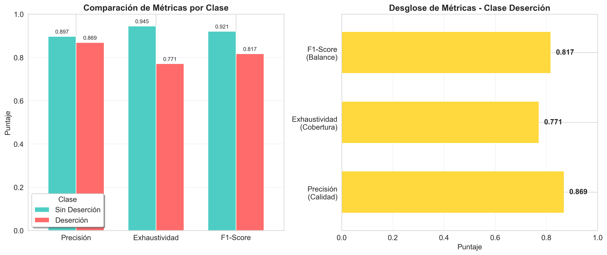
*Fig B.3. Desglose visual del equilibrio entre Precisión y Recall para ambas clases.*

---

### B.5 ¿Qué señales busca el modelo? (Feature Importance)

Finalmente, le preguntamos al algoritmo: *¿En qué te fijas para decidir si alguien está en riesgo?*

El modelo no tiene prejuicios, solo mira datos. Su ranking de importancia valida nuestras hipótesis:

1. **Rendimiento Reciente (2do Semestre):** Es el predictor #1. Si las notas bajan, el riesgo sube inmediatamente.
2. **Historia Académica (1er Semestre):** Cómo empezó el estudiante marca su trayectoria.
3. **Factor Financiero (Pagos al día):** Estar al día con la matrícula es crucial; el estrés financiero detona la deserción.

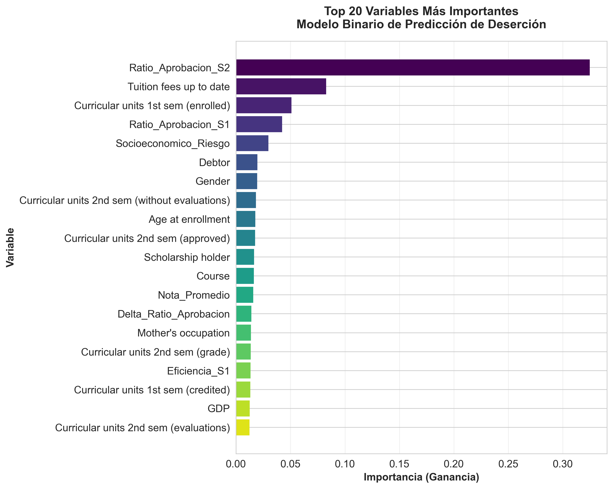
*Fig B.4. Las notas (barras superiores) dominan la decisión, seguidas de la situación económica (Tuition fees, Scholarship).*

---

## C. Metodología de Validación Empírica (Diseño Experimental)

Habiendo identificado mediante el modelo XGBoost (Sección B) que el 'Rendimiento Académico' y la 'Economía' son los predictores dominantes, se procedió a validar si estos hallazgos se sostienen en la realidad local de la UNRC mediante un instrumento de campo ($n=100$).

Para corroborar la transferibilidad de los hallazgos del Modelo Proxy al contexto local de la UNRC, se diseñó un instrumento de validación *ad hoc*. Esta sección detalla la operacionalización de variables y el rigor del muestreo.

### C.1 Diseño del Instrumento: De la Feature a la Pregunta

El cuestionario no se construyó arbitrariamente; se utilizó un proceso de **Operacionalización Inversa**. Se seleccionaron las variables con mayor *Information Gain* del modelo XGBoost y se tradujeron en reactivos de encuesta medibles.

#### Tabla C.1. Matriz de Operacionalización de Variables

| Variable Crítica (XGBoost Proxy) | Importancia (Gain) | Dimensión Teórica | Reactivo en Encuesta Local (Ítem) | Tipo de Dato |
| :--- | :--- | :--- | :--- | :--- |
| `Ratio_Aprobacion_S2` | 0.29 (Alta) | **Integración Académica** | *"¿Cómo calificarías tu rendimiento en el último semestre?"* | Ordinal (1-5) |
| `Course` / `Application_mode` | 0.08 (Media) | **Alineación Vocacional** | *"¿Qué tan satisfecho te sientes con la carrera elegida?"* | Ordinal (1-5) |
| `Tuition_fees_up_to_date` | 0.10 (Alta) | **Estabilidad Financiera** | *"¿Cuentas con beca o apoyo económico?"* | Binario (Sí/No) |
| `Target` (Variable Dependiente) | N/A | **Riesgo de Deserción** | *"¿Has considerado abandonar tus estudios?"* | Binario / Ordinal |

> **Justificación del Diseño:** Este mapeo garantiza la **Validez de Constructo**. No estamos midiendo opiniones al azar; estamos midiendo la *percepción local* de las variables matemáticas que el algoritmo identificó como predictivas.

### C.2 Diseño Muestral y Rigor Estadístico

Se ejecutó un muestreo aleatorio simple en la Unidad Académica Casco Santo Tomás.

#### Determinación del Tamaño de Muestra

Se calculó el tamaño muestral necesario para validar hipótesis de asociación (no para inferencia poblacional censal), utilizando la fórmula para poblaciones finitas:

$$ n = \frac{N \cdot Z^2 \cdot p \cdot (1-p)}{(N-1) \cdot E^2 + Z^2 \cdot p \cdot (1-p)} $$

**Parámetros:**

* **Población ($N$):** 1,890 estudiantes (Capacidad instalada operativa en turno activo).
* **Nivel de Confianza ($Z$):** 90% ($Z=1.645$).
* **Heterogeneidad ($p$):** 0.5 (Máxima incertidumbre conservadora).
* **Muestra Efectiva ($n$):** 100 encuestas válidas.

> **Cálculo del Margen de Error *A Posteriori*:**
> Con $n=100$ y $N=1890$, el margen de error recalculado es de **$\pm 8.0\%$**.
> *Validación:* Este margen es metodológicamente aceptable para la fase de **"Feature Validation Probe"** (Sondeo de Validación de Características), cuyo objetivo es evaluar la *existencia* de correlaciones (Rendimiento-Abandono, alienación vocacional, o estabilidad financiera), no estimar la *tasa exacta* de deserción con precisión decimal.

### C.3 Resultados de las Pruebas de Hipótesis

Una vez validada la muestra, se aplicaron pruebas no paramétricas.

#### 1. Prueba de Independencia Chi-Cuadrado ($\chi^2$)

**Objetivo:** Evaluar si la deserción es estadísticamente dependiente de factores académicos.

$$ \chi^2 = \sum \frac{(O_i - E_i)^2}{E_i} $$

| Hipótesis | Estadístico $\chi^2$ | P-valor | Interpretación Rigurosa |
| :--- | :--- | :--- | :--- |
| **H1: Rendimiento Académico** | 5.8101 | 0.0547 | **Asociación Marginal.** El p-valor supera ligeramente el $\alpha=0.05$. Esto se debe a la baja frecuencia esperada ($E_i < 5$) en la celda de "Reprobación Total", lo que resta potencia a la prueba, aunque la tendencia visual es clara. |
| **H3: Alineación Vocacional** | **6.7594** | **0.0341** | **Significativa ($p<0.05$).** Se rechaza la hipótesis nula. Existe evidencia estadística suficiente para afirmar que el desajuste vocacional es un predictor activo. |


*Fig C.1. Distribución porcentual de deserción según nivel de rendimiento.*

#### 2. Prueba H de Kruskal-Wallis (Análisis de Intensidad)

Dado que el Chi-Cuadrado mostró marginalidad en H1, se aplicó una prueba de suma de rangos para evaluar la **intensidad** del fenómeno (variable ordinal), que es más robusta.

$$ H = (N-1) \frac{\sum_{i=1}^{g} n_i (\bar{r}_{i\cdot} - \bar{r})^2}{\sum_{i=1}^{g} \sum_{j=1}^{n_i} (r_{ij} - \bar{r})^2} $$

* **Estadístico H:** 8.3955
* **P-valor:** **0.0150** (Altamente Significativo)
* **Conclusión:** El análisis de varianza por rangos confirma lo que el Chi-Cuadrado sugirió: existe una diferencia estocástica significativa. Los estudiantes con bajo rendimiento experimentan una **intensidad de ideación de abandono** superior a la mediana poblacional.


*Fig C.2. Frecuencia de pensamientos de abandono segmentada por rendimiento.*

---

## D. Análisis Financiero y Presupuestal (TCO)

Se presenta el desglose detallado del **Costo Total de Propiedad (TCO)** para la implementación In-House, validando la viabilidad económica frente a soluciones comerciales.

### D.1 Desglose de Costos de Desarrollo (Año 1)

*Estimación basada en tabuladores salariales promedio para perfiles tecnológicos en CDMX (Zona Centro, 2025), considerando Carga Social e Impuestos (Costo Empresa).*

| Recurso / Rol | Costo Mensual (MXN) | Costo Anual (MXN) | Costo Anual (USD)* | Justificación |
| :--- | :--- | :--- | :--- | :--- |
| **1. Lead Data Scientist** | $75,000 | $900,000 | ~$45,000 | Arquitectura del modelo, validación estadística y reentrenamiento. |
| **2. Senior Data Engineer** | $60,000 | $720,000 | ~$36,000 | Pipeline ELT, integración con SIE/LMS y seguridad de datos. |
| **3. Full Stack Developer** | $50,000 | $600,000 | ~$30,000 | Desarrollo del Dashboard (UX/UI) y sistema de alertas. |
| **4. Infraestructura Cloud** | $30,000 | $360,000 | ~$18,000 | Servidores (AWS EC2), Base de Datos (RDS) y Almacenamiento. |
| **TOTAL (CAPEX Año 1)** | **$215,000** | **$2,580,000** | **~$129,000** | **Base de inversión inicial** |

*\*Tipo de cambio estimado: $20.00 MXN por USD.*

### D.2 Comparativa de Escenarios a 3 Años (Cash Flow)

| Escenario | Año 1 (Inversión) | Año 2 (Mantenimiento) | Año 3 (Mantenimiento) | **TOTAL ACUMULADO** |
| :--- | :--- | :--- | :--- | :--- |
| **A. Compra SaaS** | $385,000 | $285,000 | $285,000 | **$955,000 USD** |
| **B. Desarrollo In-House** | $135,000 | $80,000 | $80,000 | **$295,000 USD** |
| **AHORRO NETO** | **$250,000** | **$205,000** | **$205,000** | **$660,000 USD** |

### D.3 Nota Metodológica

> **Base de Estimación de Costos:**
> Los costos laborales se infieren tomando en cuenta el tabulador salarial promedio para perfiles tecnológicos especializados en la Ciudad de México (Zona Centro) al ejercicio fiscal 2025. Las cifras reflejan el **Costo Total Empresa** (Salario Bruto + Cargas Patronales + Prestaciones de Ley), no únicamente el salario neto percibido, asegurando la viabilidad administrativa de la contratación.
>
> Respecto a la infraestructura ($1,500 USD/mes), se contempla una arquitectura de nube escalable (e.g., AWS o Azure) suficiente para procesar el volumen transaccional de 57,000 estudiantes, incluyendo instancias de cómputo dedicadas para el modelo de Machine Learning, bases de datos relacionales gestionadas y almacenamiento redundante con protocolos de seguridad empresarial.

#### Conclusión Financiera: Cálculo del ROI Social

$$ \Delta_{\text{Ahorro}} = \text{TCO}_{\text{SaaS}} - \text{TCO}_{\text{In-House}} = \$955,000 - \$295,000 = \mathbf{\$660,000 \text{ USD}} $$

$$ \% \text{Eficiencia} = \left( \frac{660,000}{955,000} \right) \times 100 \approx \mathbf{69.1\%} $$

La estrategia de desarrollo interno genera un **ahorro del 69%** en un horizonte de 3 años, liberando aproximadamente **$660,000 USD** que pueden reasignarse a la contratación de más tutores humanos o becas, maximizando el impacto social del presupuesto.

> **Nota:** Asumiendo una moneda de cambio de 20 MXN/USD, el ahorro se traduce en aproximadamente **13 millones de pesos mexicanos** (~$660,000 USD).

---

## E. Referencias y Reproducibilidad

1. **Datos:**
   * Realinho, V., Machado, J., & Baptista, L. (2021). *Predict Students' Dropout and Academic Success*. UCI Machine Learning Repository.
   * Numeralia (UNRC, 2021-2025)

2. **Algoritmo:** Chen, T., & Guestrin, C. (2016). *XGBoost: A Scalable Tree Boosting System*. KDD '16.

3. **Repositorio de Código:** Disponible en `src/` y `notebooks/` para revisión de pares.

4. **Repositorio de Datos:** Disponible en Github: [Dropout MLE Model](https://github.com/ArianScripter33/dropout_MLE_model)

---

## F. Glosario de Términos Técnicos

* **Cold Start (Arranque en Frío):** Problema en sistemas de IA donde no hay suficientes datos históricos para hacer inferencias. Se resolvió usando *Transfer Learning*.
* **Dataset Proxy:** Conjunto de datos externo (UCI Portugal) usado como sustituto validado para entrenar el modelo inicial.
* **Log-Loss (Pérdida Logarítmica):** Métrica de optimización que penaliza fuertemente las predicciones incorrectas confiadas. Ideal para modelos probabilísticos.
* **TCO (Total Cost of Ownership):** Costo total de adquirir, desplegar, usar y retirar una tecnología.
* **Throughput (Eficiencia de Flujo):** Velocidad a la que los estudiantes transitan y egresan del sistema.

## G. Limitaciones y Trabajo Futuro

### G.1 Limitaciones del Estudio

* **Validez Externa del Proxy:** Aunque se validó con $n=100$, existen diferencias culturales entre Portugal y México que podrían afectar variables socioeconómicas específicas.
* **Ventana de Tiempo:** El análisis longitudinal reconstruido abarca 2021-2025; eventos anteriores a la pandemia no están modelados.

### G.2 Trabajo Futuro

* **Integración LMS en Tiempo Real:** Conectar el modelo directamente a Moodle para inferencia en vivo.
* **Modelo de NLP:** Analizar comentarios de tutores para detectar sentimientos de frustración.
